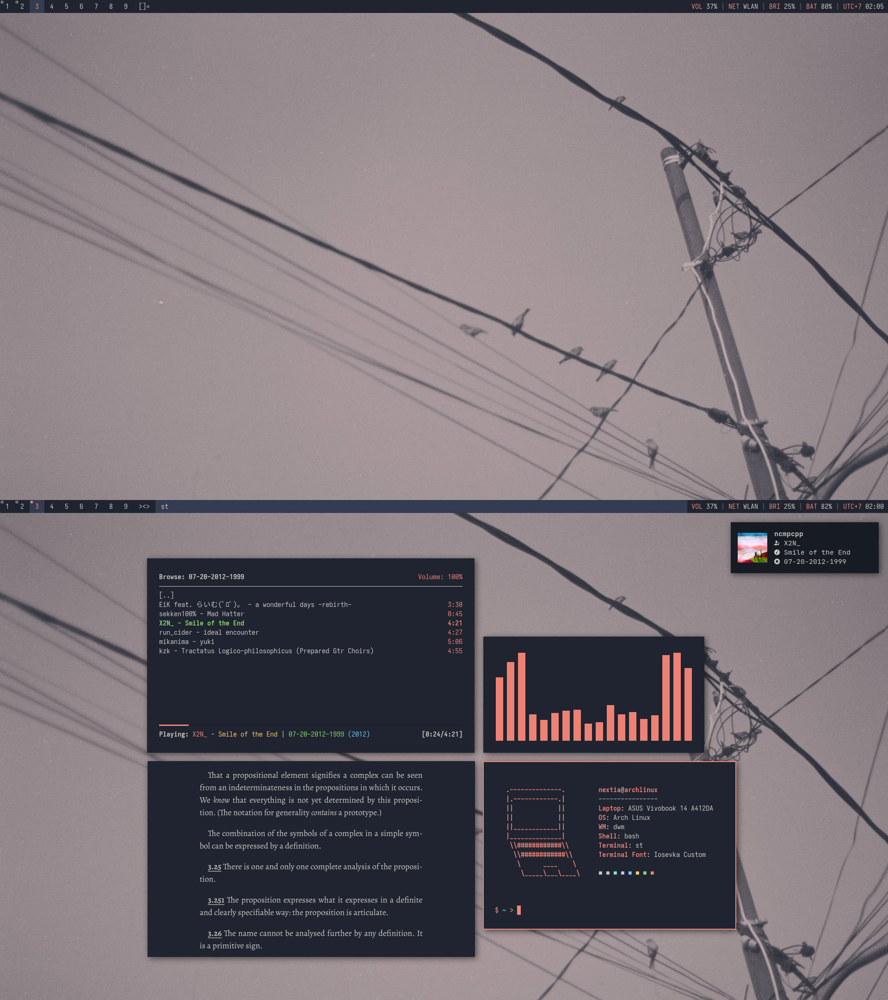

# dwm
a build of my personal dwm setup, configured with lots of headaches and stress.

## Preview

## External Links
- [Nathanielevan's Iosevka Build](https://github.com/nathanielevan/dotfiles/tree/master/.local/share/fonts/IosevkaCustom)
- [dotfiles](https://github.com/nextiaindex/dotfiles)
- [st-flexipatch](https://github.com/nextiaindex/st-flexipatch)
- [dwmblocks](https://github.com/nextiaindex/dwmblocks)
- [slock](https://github.com/nextiaindex/slock)
